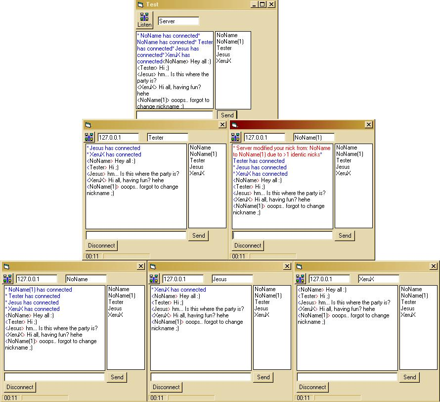



## A chat system v 1\.1 \(UPDATED\)

### Description

This is great code to learn from. You'll discover how easy it is to create a multi-connection server / client and put together a chat-system with commands such as "ADD" "REM" ... and colors, splitting, NICKLIST!!! Please vote for me, or leave a comment.. :) btw.. heavily commented code!
 
### More Info
 

             |
---                |---
**Submitted On**   |2004-02-22 00:05:22
**By**             |[&\#216;yvind](https://github.com/Planet-Source-Code/PSCIndex/blob/master/ByAuthor/216-yvind.md)
**Level**          |Intermediate
**User Rating**    |4.7 (28 globes from 6 users)
**Compatibility**  |VB 3\.0, VB 4\.0 \(16\-bit\), VB 4\.0 \(32\-bit\), VB 5\.0, VB 6\.0
**Category**       |[Internet/ HTML](https://github.com/Planet-Source-Code/PSCIndex/blob/master/ByCategory/internet-html__1-34.md)
**World**          |[Visual Basic](https://github.com/Planet-Source-Code/PSCIndex/blob/master/ByWorld/visual-basic.md)
**Archive File**   |[A\_chat\_sys1711922222004\.zip](https://github.com/Planet-Source-Code/216-yvind-a-chat-system-v-1-1-updated__1-51924/archive/master.zip)

